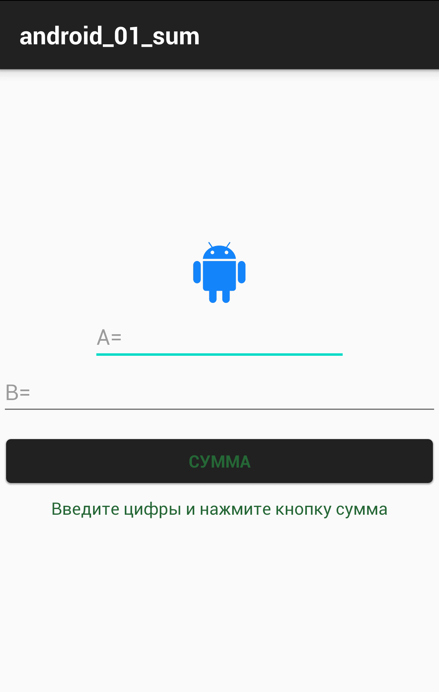

# android_01_sum

**********************************************
## **activity_main.xml
```
<?xml version="1.0" encoding="utf-8"?>

<!-- будет линейная компоновка элементов, окно на весь экран,
компоненты должны располагаться вертикально по-центру экрана -->
<LinearLayout
    xmlns:android="http://schemas.android.com/apk/res/android"
    xmlns:app="http://schemas.android.com/apk/res-auto"
    android:layout_width="match_parent"
    android:layout_height="match_parent"
    android:orientation="vertical"
    android:gravity="center">

    <!-- картинка "androidify" на всю ширину экрана с масштабированием и по высоте 50 пикселей типа "dp" -->
    <ImageView
        android:id="@+id/imageView"
        android:layout_width="wrap_content"
        android:layout_height="50dp"
        android:scaleType="fitCenter"
        app:srcCompat="@drawable/androidify" />

    <EditText
        android:id="@+id/editText_a"
        android:layout_width="wrap_content"
        android:layout_height="wrap_content"
        android:ems="10"
        android:hint="A="
        android:layout_marginTop="5dp"
        android:inputType="textPersonName" />

    <!-- поле ввода текста на всю ширину экрана, с авто размером по высоте,
     любые символы и снизу отступ в 5dp -->
    <EditText
        android:id="@+id/editText_b"
        android:layout_width="match_parent"
        android:layout_height="wrap_content"
        android:hint="B="
        android:layout_marginBottom="5dp"
        android:inputType="textPersonName" />

    <!-- кнопка на всю ширину экрана и с авто размером по высоте,
     при нажатии будет искать и вызывать метод "onClick",
     отступ по краям 5dp -->
    <Button
        android:id="@+id/button"
        android:layout_width="match_parent"
        android:layout_height="wrap_content"
        android:layout_margin="5dp"
        android:onClick="onClick"
        android:textColor="#256736"
        android:text="СУММА" />

    <!-- текстовое поле для ответа на всю ширину экрана,
     с авто размером по высоте, по-центру экрана и заданным цветом текста -->
    <TextView
        android:id="@+id/textView_sum"
        android:layout_width="match_parent"
        android:layout_height="wrap_content"
        android:text="Введите цифры и нажмите кнопку сумма"
        android:textColor="#256736"
        android:gravity="center" />
</LinearLayout>
```

## **MainActivity.java**
```
package com.ruslan.android_01_sum;

import androidx.appcompat.app.AppCompatActivity;

import android.os.Bundle;
import android.view.View;
import android.widget.EditText;
import android.widget.TextView;

public class MainActivity extends AppCompatActivity {

    @Override
    protected void onCreate(Bundle savedInstanceState) {
        super.onCreate(savedInstanceState);
        setContentView(R.layout.activity_main);
    }

    //метод кнопки расчёта
    public void onClick(View v) {

        //доступ к компонентам окна
        EditText editText_a = (EditText) findViewById(R.id.editText_a);
        EditText editText_b = (EditText) findViewById(R.id.editText_b);
        TextView textView_sum = (TextView) findViewById(R.id.textView_sum);

        double a, b, c; //объявление локальных переменных

        //чтение данных из компонент
        a = Double.valueOf(editText_a.getText().toString());
        b = Double.valueOf(editText_b.getText().toString());

        c = a + b; //алгоритм

        //вывод полученного значения в компонент
        textView_sum.setText(String.valueOf(c));
    }
}
```

